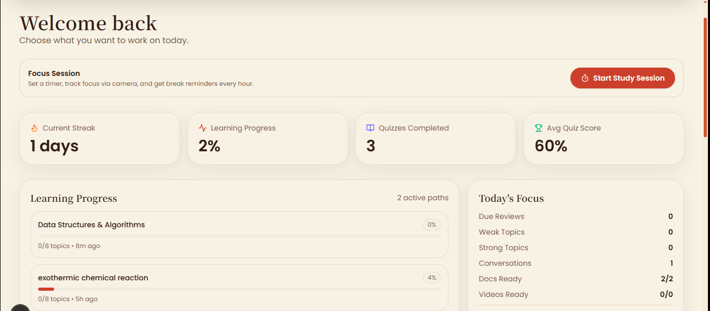
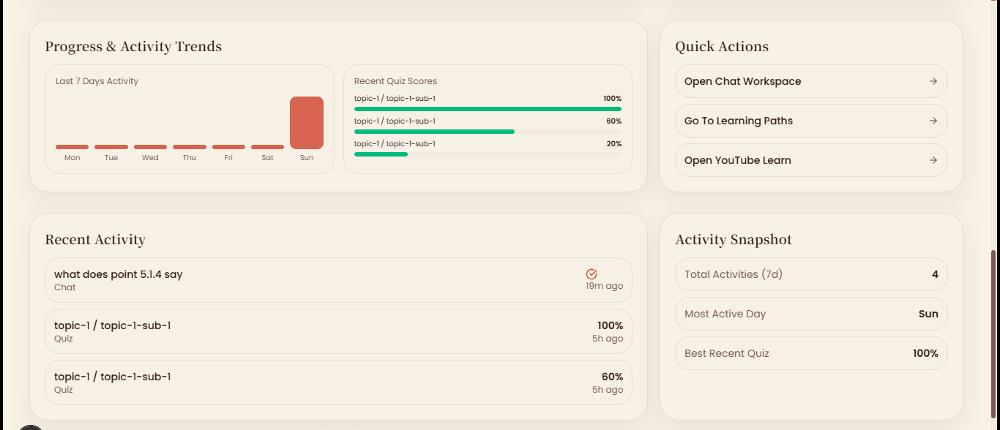
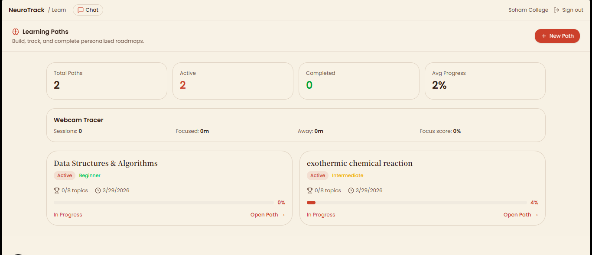
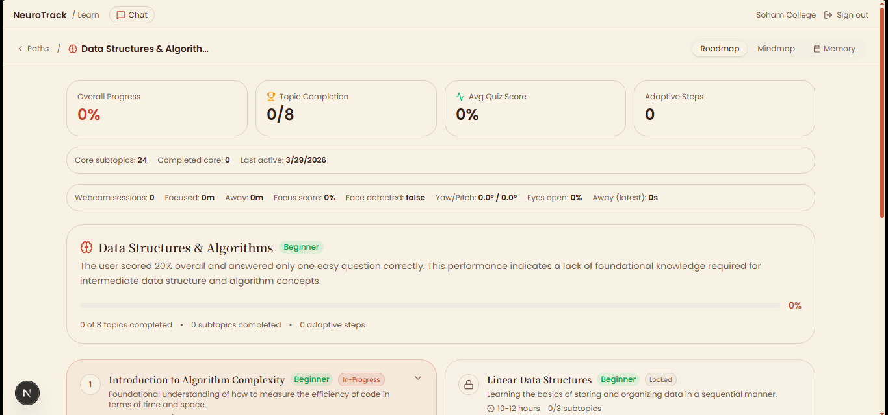
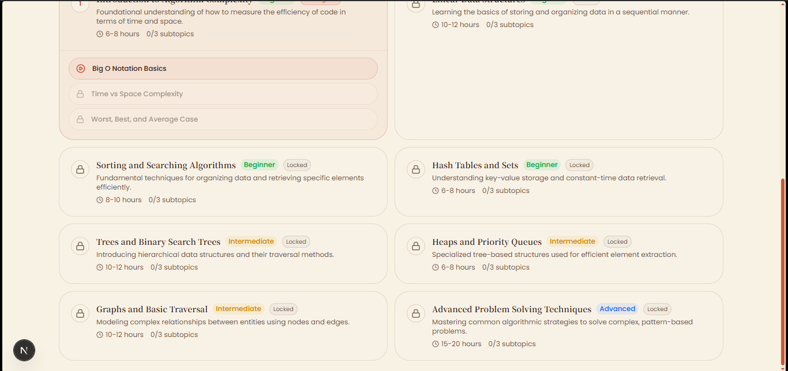
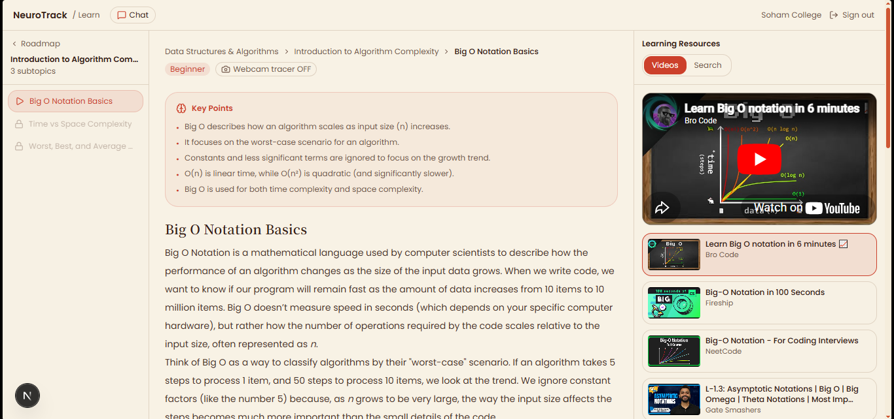
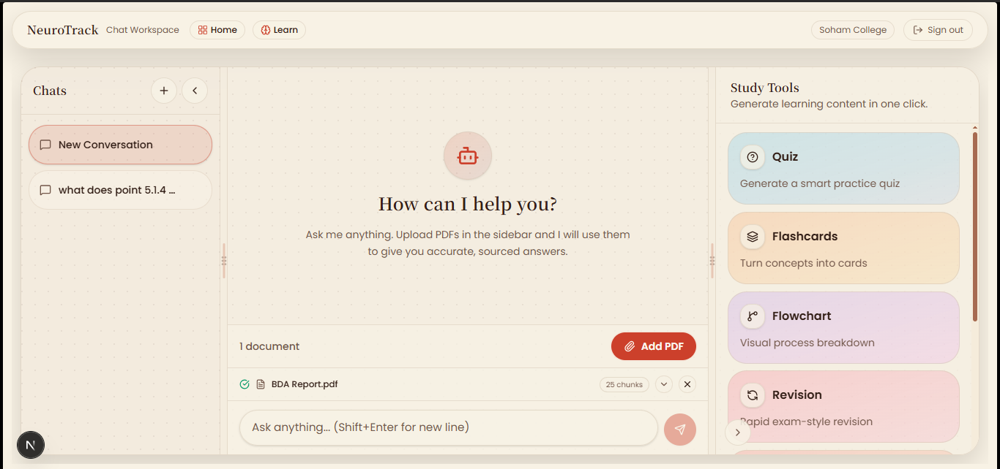
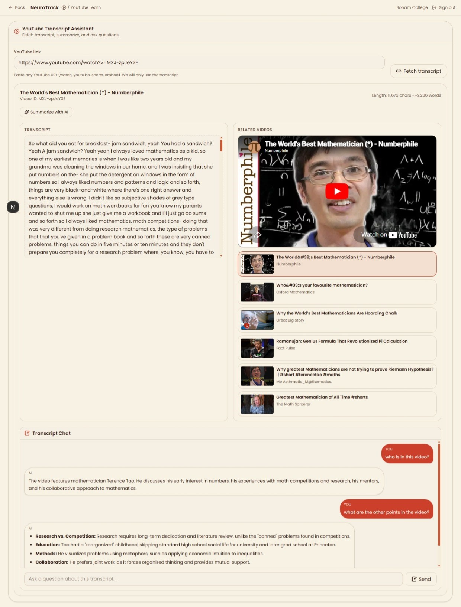

# NeuroTrack Learning Platform

A full-stack AI learning companion combining personalized learning paths, a RAG-powered chat workspace, auto-generated quizzes/flashcards/flowcharts, and YouTube transcript Q&A. Screenshots live in `codecrafters-3.0/frontend/apps/web/public`.

## Feature tour

### Dashboard
- Snapshot of streak, learning progress, quizzes completed, average score, and chosen topics.
- Activity trends and most recent actions help learners stay on track.
- Screenshots:
  - 
  - 

### Learning paths
- Topic selection with per-topic stats and progress tracking.
- Detailed, prerequisite-aware roadmaps laid out in priority order.
- Content hub with resources and embedded videos per roadmap topic.
- Screenshots (in order):
  - 
  - 
  - 
  - 

### RAG workspace
- Upload documents and chat with grounded answers (ANN vector search + Gemini embeddings).
- Generates quizzes, flowcharts, flashcards, and last-minute revision notes from the same context.
- Screenshots (top to bottom):
  - 
  - 
  - 
  - 
  - 

### YouTube transcript Q&A
- Paste a YouTube link, fetch the transcript, ground AI answers on it, and suggest similar videos.
- Screenshot: 

## Architecture
- **Frontend:** Next.js 16 (Turbopack), React 19, NextAuth, theme switching, Turborepo monorepo, shared UI package.
- **Backend:** Node.js/Express, JWT auth, Mongoose for MongoDB, Multer for uploads, Nodemailer for email OTP, Cloudinary for media.
- **AI/RAG:** Google Gemini for embeddings (3072-dim) and generation; Qdrant (and Pinecone option) for vector storage with user/conversation scoping and cosine similarity; ANN search drives retrieval.
- **Media/Extras:** YouTube transcript fetching, pdf parsing, revision exports (jsPDF on frontend), Mermaid flowchart rendering.

## RAG data flow (high level)
1. Ingest document → chunk → embed with Gemini (`gemini-embedding-001`, 3072 dims).
2. Upsert vectors with user/conversation metadata into Qdrant/Pinecone (cosine ANN search).
3. On questions, retrieve top-K matches → build context → Gemini chat (`gemini-3.1-flash-lite-preview`) answers grounded to context.
4. The same context powers quiz (15 MCQs), flashcards (15), flowcharts (Mermaid), and revision bullets.

## Project structure (trimmed)
- backend/ — Express app, routes, models, services (Gemini, Qdrant/Pinecone, Cloudinary, mail).
- frontend/apps/web/ — Next.js app (pages in `app/`, middleware, components, hooks, contexts, public assets).
- frontend/packages/ui/ — Shared UI components/styles.
- frontend/packages/eslint-config & typescript-config — Shared tooling presets.

## Getting started
1. **Prereqs:** Node.js >= 20, npm, MongoDB instance; Qdrant (or Pinecone) endpoint; Cloudinary account; Gemini API key.
2. **Backend setup**
   - `cd backend`
   - `npm install`
   - Copy `.env.example` to `.env` (or create) with at least: `PORT`, `MONGO_URI`, `JWT_SECRET`, `GEMINI_API_KEY`, `QDRANT_URL`, `QDRANT_API_KEY`, `QDRANT_COLLECTION`, `PINECONE_API_KEY`, `PINECONE_INDEX_NAME`, `CLOUDINARY_*`, `EMAIL_*`.
   - Run dev server: `npm run dev` (nodemon) or `npm start`.
3. **Frontend setup**
   - `cd frontend`
   - `npm install`
   - Dev server: `npm run dev` (Turbo runs Next.js app in apps/web)
   - Build: `npm run build`
4. Open the app (default Next dev port 3000) and sign up/login to start a session.

## Environment notes
- Qdrant defaults to `http://localhost:6333` and collection `codecrafter` if not set.
- Pinecone client is optional; set `PINECONE_API_KEY`/`PINECONE_INDEX_NAME` to enable it.
- Gemini transcript features can use `GEMINI_API_KEY_TRANSCRIPT` to separate quotas.

## Key scripts
- **Backend:** `npm run dev` (watch), `npm start`.
- **Frontend root:** `npm run dev`, `npm run build`, `npm run lint`, `npm run format`, `npm run typecheck`.
- **Frontend app (apps/web):** `npm run dev`, `npm run build`, `npm run start` (from `apps/web`).

## Conventions
- Images for docs live in `frontend/apps/web/public` and are referenced with relative paths for GitHub preview compatibility.
- Vector IDs are user-scoped; Qdrant indexes payload fields `userId` and `conversationId` for filtered search.
